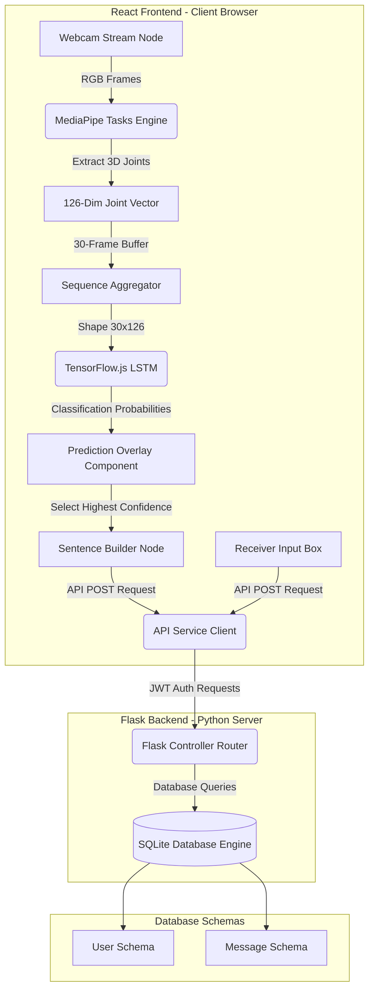

# Project Documentation: Vision-Based ASL Interpreter
## Real-Time Hand Gesture Classification with MediaPipe and TensorFlow.js / LSTM

---

## INDEX

| SL NO. | TITLE | PAGE NO (EST.) |
|--------|-------|----------------|
| 1      | [1. INTRODUCTION](#1-introduction) | 1 |
| 2      | [2. LITERATURE SURVEY](#2-literature-survey) | 5 |
| 3      | [3. STUDY PHASE](#3-study-phase) | 13 |
| 4      | [4. DESIGN PHASE](#4-design-phase) | 22 |
| 5      | [5. ARCHITECTURE](#5-architecture) | 29 |
| 6      | [6. ALGORITHMS USED](#6-algorithms-used) | 36 |
| 7      | [7. HARDWARE AND SOFTWARE TECHNOLOGIES](#7-hardware-and-software-technologies) | 41 |
| 8      | [8. ADVANTAGES AND DISADVANTAGES](#8-advantages-and-disadvantages) | 45 |
| 9      | [9. CONCLUSION](#9-conclusion) | 48 |
| 10     | [10. FUTURE SCOPE](#10-future-scope) | 49 |
| 11     | [11. REFERENCES](#11-references) | 51 |

---

## 1. INTRODUCTION

### 1.1 Project Overview & Background
Hand gesture recognition is a fundamental pillar of Human-Computer Interaction (HCI). It offers an intuitive, touchless interface for controlling digital systems, bridging the gap between natural human expression and physical hardware response. In the context of accessibility, hand gesture translation is highly significant, particularly for American Sign Language (ASL). ASL is a complete, complex language employing signs made by moving the hands combined with facial expressions and postures of the body. For individuals who are deaf or hard-of-hearing, interacting with individuals who do not speak sign language represents a substantial communicative barrier. 

Historically, sign language interpretation has relied on human translators, which is not always scalable or immediately available in everyday situations (such as public services, retail, or rapid workplace collaboration). With the rise of high-performance mobile devices, standard high-definition webcams, and advancements in deep learning, computer vision models have emerged as a viable solution for real-time translation.

This project presents a web-based, real-time sign language recognition system that combines:
1. Google's **MediaPipe Tasks API (Hand Landmarker)** for high-speed, scale-invariant hand tracking.
2. A client-side deep neural network model leveraging **Long Short-Term Memory (LSTM)** nodes running via **TensorFlow.js** to evaluate temporal movements across a continuous sequence of hand actions.
3. An interactive full-stack web application featuring user authentication, guest sessions, personal settings, and a dual chat application context representing the communication interface between an ASL signer and a text-based receiver node.

```
+--------------------+      +--------------------+      +--------------------+
|  Signer Webcam     | ---> | MediaPipe Tracking | ---> |  Coordinate Map    |
|  (RGB Video Feed)  |      | (21 3D Landmarks)  |      |  (126-Dim Vector)  |
+--------------------+      +--------------------+      +--------------------+
                                                                   |
                                                                   v
+--------------------+      +--------------------+      +--------------------+
|  Sentence Output   | <--- |  LSTM Classifier   | <--- | 30-Frame Sequence  |
|  (Receiver Chat)   |      |  (TensorFlow.js)   |      | (Temporal Buffer)  |
+--------------------+      +--------------------+      +--------------------+
```

The system operates fully inside standard modern browsers, utilizing the client's local GPU or CPU via WebGL/Wasm pipelines, minimizing server-side latency and eliminating the need to transmit raw video frames over the internet.

---

### 1.2 Project Objectives
The system was engineered with several fundamental milestones in mind:
- **Robust Landmark Detection**: Deploy a high-fidelity joint detection mechanism using Google's newer MediaPipe Tasks API to identify and draw 21 distinct three-dimensional coordinates per hand.
- **Client-Side Deep Learning Execution**: Load and run a deep sequence-learning model (LSTM) directly in the client's browser utilizing TensorFlow.js. This ensures zero cloud server inference latency, lower host server costs, and enhanced user privacy.
- **Dual Chat Node Environment**: Design an interactive chat platform containing a signer workspace (webcam stream, skeleton tracking canvas, recording triggers, status dashboard) and a receiver workspace (a text messaging layout displaying translated sentences and accepting keyboard-based responses).
- **Extensible Vocabulary Setup**: Structure the pipeline to process custom gesture dictionaries. The underlying tracking and inference scripts handle flexible configurations defined by a single mapping file (`word_to_idx.json`), allowing new gestures to be added by retraining the sequence layer without re-architecting the frontend source code.
- **Robust Multi-Condition Operation**: Provide real-time UI cues, status badges, shortcut controls, and adaptive rendering mechanics (such as image brightness adjustment and video mirroring) to make the system resilient in diverse operating environments.
- **Secure Full-Stack Persistence**: Build a companion Flask backend using a SQLite database to manage authentications (securely storing hashed credentials) and logging chat history transcripts for subsequent recall.

---

### 1.3 Motivation
The development of a vision-based ASL interpreter stems from multiple socio-technical factors:
1. **Accessibility and Inclusivity**: Millions of individuals globally communicate primarily through sign language. A tool that translates their signs into standard text (and vice versa) helps level the playing field in educational, clinical, and corporate environments.
2. **Touchless Human-Computer Interaction**: During public health crises or within sterile medical spaces (such as operating theatres), physical interfaces like touchscreens, keyboards, and mice pose contamination hazards. Camera-based gesture control offers a zero-contact alternative.
3. **Emerging Ecosystems**: Modern computing is shifting towards ambient, context-aware frameworks. Smart home consoles, industrial machinery controllers, augmented reality (AR) lenses, and vehicle infotainment consoles increasingly rely on spatial computing, where hand gesture classification is standard.
4. **Offline Capability & Privacy Preservation**: Transmitting video feeds to server-side deep learning architectures consumes bandwidth and introduces data breach concerns. Localized browser processing protects the user's raw image stream.

---

### 1.4 Scope of the Project

#### 1.4.1 In-Scope Features
- **Real-Time Landmark Extraction**: Capturing frames from standard RGB webcams at standard resolutions (480p, 720p, 1080p) and converting them into normalized coordinate maps via `@mediapipe/tasks-vision`.
- **Temporal Modeling**: Continuous buffering of joint maps across 30 sequential frames, handling tracking losses via shape-matching and padding.
- **Client-Side Evaluation**: Instantiating trained Keras Layer/Graph models in the browser to compute classification probabilities locally.
- **Dynamic Vocabulary Visualization**: Fetching and displaying the registered dictionary dynamic list (`word_to_idx.json`) for verification.
- **Signer-Receiver Chat Platform**: A split-screen layout displaying translations, building sentences word-by-word, and permitting normal text entry from the conversation partner.
- **Authentication Services**: Full backend registration, standard login, secure bcrypt password validations, JWT authorization headers, and automatic temporary Guest session creation.
- **Hardware Agility**: Support for webcam hot-swapping, image mirroring controls, brightness adjustments, and hand coordinate skeletal line toggle.

#### 1.4.2 Out-of-Scope Features
- **Complex Continuous Sign Language Grammar Synthesis**: Synthesizing raw, unstructured sequence streams into natural language sentences with auxiliary tense changes. The system focuses on isolated vocabulary building and fingerspelled words.
- **Fine Facial Gesture or Lip Reading Integration**: The system strictly processes hand tracking; facial cues are not processed.
- **Two-Hand Concurrent Interlocking Postures**: The model focuses on single-hand inputs, padding the second hand with zeros if absent, and is not trained on complex interlocked two-hand signs.
- **Direct Edge Compiler / Mobile Native Builds**: Deploying directly as native iOS or Android apps. The software is targeted at web applications (React + Vite).

---

## 2. LITERATURE SURVEY

### 2.1 Early Gesture Recognition Methodologies
Research into hand gesture recognition (HGR) dates back to the early stages of virtual reality and robotics. Early methods relied heavily on physical sensing hardware before computer vision reached mature accuracy rates.

#### 2.1.1 Hardware-Based Systems
The earliest systems utilized specialized wearables, commonly referred to as "Data Gloves". These gloves integrated physical sensors along the fingers and wrist to measure joint movement directly.
- **DataGlove (Zimmerman et al., 1987)**: Embedded optical fiber loops along the fingers. As joints bent, light escaped from the fibers, altering the signal intensity received at phototransistors.
- **CyberGlove**: Used resistive bend sensors. While providing precise joint angles, these devices were costly (often thousands of dollars), required frequent calibration, and restricted natural movement due to bulky wiring.

#### 2.1.2 Traditional Computer Vision (Pre-Deep Learning)
As cameras became standard peripherals, researchers shifted to passive vision-based tracking:
- **Skin Color Segmentation**: Segmenting hands by mapping pixel colors to skin-tone spaces (such as HSV or YCbCr). While computationally lightweight, these methods frequently failed under varying lighting conditions, complex backgrounds, and when the user's face was visible.
- **Contour and Shape Features**: Applying Canny edge detection, Sobel filters, or thresholding to extract hand outlines. Convexity defects were analyzed to count fingers. These techniques were fragile, failing during hand rotations or when fingers overlapped (occlusion).
- **Hand-Crafted Keypoint Descriptors**: Utilizing algorithms like **Histogram of Oriented Gradients (HOG)**, **Scale-Invariant Feature Transform (SIFT)**, or **Oriented FAST and Rotated BRIEF (ORB)** combined with support vector machines (SVMs) or random forest classifiers. These classifiers struggled to scale beyond small vocabularies and lacked temporal support for dynamic, moving gestures.

---

### 2.2 The Deep Learning Era
The introduction of Convolutional Neural Networks (CNNs) changed hand gesture recognition by replacing hand-crafted feature extractors with learned hierarchical representations.

#### 2.2.1 2D Convolutional Neural Networks (Static Postures)
CNNs process raw spatial coordinates directly. By training on thousands of images, a 2D CNN learns to classify static hand signs (such as the ASL alphabet or static numbers). However, 2D CNNs treat each frame independently, making them unable to classify dynamic gestures (such as "sorry", "thank you", or "family") where meaning depends on motion.

#### 2.2.2 3D Convolutional Neural Networks (Spatiotemporal Video Processing)
To capture time-based information, researchers introduced 3D CNNs. By using 3D convolution kernels that slide across both space (height and width) and time (frames), these networks learn spatial and motion features simultaneously. Despite their accuracy, 3D CNNs are computationally expensive, require high-end graphics processing units (GPUs), and are difficult to deploy on standard client browsers.

#### 2.2.3 Graph Convolutional Networks (GCNs)
Because the human hand resembles a structural graph (joints as nodes and bones as edges), researchers have applied Graph Convolutional Networks (GCNs). Models like **Spatial-Temporal Graph Convolutional Networks (ST-GCN)** process keypoints rather than raw pixels. However, constructing dynamic graphs for varying hand shapes can be complex, and these networks require customized libraries that may lack native support in standard browser runtimes like WebGL.

#### 2.2.4 Transformer Networks
Self-attention architectures (Transformers) have been adapted for action recognition by modeling relationships between sequential frames. While Transformers achieve high accuracy, they require significant memory and processing power, making them less suitable for lightweight client-side applications on standard hardware.

#### 2.2.5 Recurrent Neural Networks and LSTMs
To model sequential data efficiently on standard hardware, researchers combine spatial feature extractors with recurrent layers. **Long Short-Term Memory (LSTM)** networks address the vanishing gradient problem of standard Recurrent Neural Networks (RNNs) by using memory cells and gating mechanisms. By feeding a sequence of coordinate vectors into an LSTM, the network learns temporal patterns over time.

---

### 2.3 Key Pose Estimation Models
To feed clean coordinate vectors into an LSTM, we need a spatial landmark detector. Key models include:
- **OpenPose (Cao et al., 2017)**: Extracts multi-person keypoints (body, hands, face) from RGB images. While accurate, OpenPose is computationally heavy and requires local GPU support.
- **Hand3D (Zimmermann & Brox, 2017)**: Estimates 3D hand poses from single RGB images using a deep CNN. Its complex architecture makes real-time deployment challenging on mobile devices or in-browser.
- **MediaPipe Hands (Zhang et al., 2020)**: A real-time hand-tracking framework designed for mobile and web environments. It uses a two-stage pipeline: a palm detector (BlazePalm) that locates hands, followed by a landmark regression model that predicts 21 3D coordinates. MediaPipe runs efficiently on standard CPUs, making it ideal for browser-based applications.

---

### 2.4 Literature Survey Summary Table

| SL NO. | METHOD / PAPER | AUTHOR / YEAR | TECHNOLOGIES | ADVANTAGES | DRAWBACKS / LIMITATIONS | METHOD TYPE |
|---|---|---|---|---|---|---|
| 1 | **DataGlove: A Hand Gesture Interface Device** | Zimmerman et al. (1987) | Fiber-optic sensors, resistive sensors, analog encoders. | High physical coordinate precision; immune to lighting/background conditions. | High hardware cost; bulky wiring; requires calibration for each user. | Sensor / Glove-based |
| 2 | **Long Short-Term Memory** | Hochreiter & Schmidhuber (1997) | Recurrent Neural Networks, gating units. | Solves vanishing gradient problem; retains long-range dependencies. | Computationally slow during long sequence processing. | Recurrent Network |
| 3 | **Realtime Multi-Person Pose Estimation** | Cao et al. (OpenPose, 2017) | Convolutional Neural Networks, Part Affinity Fields (PAF). | Detects body, face, and hand joints simultaneously. | High computational cost; requires dedicated GPU. | Spatial Pose Estimation |
| 4 | **Online Detection of Dynamic Hand Gestures** | Molchanov et al. (2016) | 3D CNN, RNN, Connectionist Temporal Classification (CTC). | Classifies dynamic gestures in video streams. | High memory footprint; requires high-end hardware. | Spatiotemporal Deep Learning |
| 5 | **MediaPipe Hands: On-device Real-time Tracking** | Zhang et al. (Google, 2020) | MobileNet, BlazePalm detector, regression models. | Runs in real-time (30+ FPS) on standard CPU hardware. | Accuracy decreases under partial hand occlusion. | Spatial Pose Estimation |
| 6 | **Real-time Hand Gesture Classification on CPU** | Köpüklü et al. (2019) | Lightweight 3D CNNs, Motion History Images (MHI). | Runs on standard CPU hardware without GPU. | Limited to a small vocabulary of predefined gestures. | Spatiotemporal Deep Learning |
| 7 | **Attention Is All You Need** | Vaswani et al. (2017) | Self-Attention, Transformer Layers. | Processes sequences in parallel; models long-range relationships. | High memory usage; requires large training datasets. | Attention Network |
| 8 | **Vision-Based Hand Gesture Recognition: A Survey** | Sharma & Singh (2021) | Survey of pre-processing, segmentation, and classification methods. | Comprehensive comparison of traditional vs. modern approaches. | No new algorithm or implementation proposed. | Academic Review |
| 9 | **Spatial Temporal Graph CNN for Action Recognition** | Yan et al. (2018) | Graph Convolutional Networks, skeleton graph. | Captures joint relationships directly. | High complexity; difficult to deploy in-browser. | Skeletal Graph Learning |
| 10 | **The Jester Dataset & Video Classification** | Materzynska et al. (2019) | 3D ResNet, deep video models, large dataset. | Large, diverse dataset of hand gestures. | Models trained on Jester require significant resources. | Dataset / Benchmark |

---

### 2.5 Research Gaps identified
Despite the progress in gesture recognition, several gaps remain:
1. **High Infrastructure Barriers**: Many systems require high-end GPU clusters, making them inaccessible to typical users.
2. **Poor Extensibility**: Many models use fixed architectures trained on specific datasets (like ASL only), requiring complete retraining to add new gestures.
3. **Complex Setup Requirements**: Many systems lack a unified, user-friendly interface, requiring manual file management and command-line execution.
4. **Outdated API Dependencies**: Many web implementations rely on deprecated MediaPipe Solutions APIs rather than the modern Tasks API, which offers better performance and long-term support.

This project addresses these gaps by combining the **MediaPipe Tasks API** with a client-side **TensorFlow.js LSTM** model in a unified, full-stack React and Flask web application.

---

## 3. STUDY PHASE

### 3.1 Existing Systems vs. The Proposed System
To understand the improvements introduced by this project, we compare it with existing approaches:

#### 3.1.1 Legacy Vision Systems
Older systems relied on color segmentation, thresholding, and contour tracking. These systems were highly sensitive to environmental factors like lighting variations and background clutter, making them unreliable for general use.

#### 3.1.2 Server-Side Deep Learning Systems
Many modern systems transmit raw video frames to a GPU-enabled server for inference. While accurate, this approach introduces significant network latency, consumes bandwidth, and raises data privacy concerns since raw video is sent over the network.

#### 3.1.3 The Proposed Web-Based Client-Side System
This project implements a hybrid approach:
- **Perception Layer (Client-Side)**: Uses the browser-based MediaPipe Tasks API to extract 21 3D landmarks in real-time.
- **Inference Layer (Client-Side)**: Uses TensorFlow.js to run the LSTM model directly on the client's device, ensuring low latency and data privacy.
- **Control and Messaging Layer (Full-Stack)**: Connects the local interpreter with a Flask and SQLite backend to support user login and persistent chat history.

```
+-----------------------------------------------------------------------------+
| BROWSER RUNTIME                                                             |
|                                                                             |
|  [Webcam Stream]                                                            |
|         | (Raw RGB Frames)                                                  |
|         v                                                                   |
|  [MediaPipe Tasks API] --(Extract coordinates)--> [126-Dimensional Vector]  |
|                                                            |                |
|                                                            v                |
|  [Display Results] <---(Top Predictions)--- [TensorFlow.js LSTM Model]       |
+-----------------------------------------------------------------------------+
                                                     | (Rest API Calls)       |
                                                     v                        |
+-----------------------------------------------------------------------------+
| BACKEND SERVER                                                              |
|                                                                             |
|  [Flask API Engine] <--------------------------------------------------->   |
|         |                                                                   |
|         v                                                                   |
|  [SQLite Database] (Stores User Sessions & Message Logs)                    |
+-----------------------------------------------------------------------------+
```

---

### 3.2 Technical Limitations and Challenges

#### 3.2.1 Hand Occlusion
When fingers overlap or the hand rotates away from the camera, landmarks can be lost. This project addresses this by padding missing values with zeros to maintain sequence shape.

#### 3.2.2 Computational Overhead
Running deep learning models in the browser can cause frame drops on low-end hardware. The project uses WebGL and WebAssembly backends, and warms up the model upon loading to ensure smooth inference.

#### 3.2.3 Prediction Flickering
Rapid movements can cause predictions to flicker between classes. This is addressed by using confidence thresholds to filter out low-confidence predictions.

#### 3.2.4 User-Specific Overfitting
Models trained on a single user may not generalize well. Collecting diverse training data helps improve generalization.

---

### 3.3 Optimal Solutions Implemented

- **MediaPipe Tasks API**: Migrating to the newer Tasks API (`@mediapipe/tasks-vision`) ensures better performance and compatibility compared to legacy libraries.
- **Model Warm-Up**: Passing a dummy tensor through the model at startup compiles WebGL shaders, avoiding latency spikes during initial predictions.
- **Memory Management**: Explicitly disposing of unused tensors using `tf.tidy()` prevents memory leaks during continuous prediction loop execution.
- **Normalized Coordinates**: Using coordinates normalized relative to the hand bounding box ensures translation, scale, and rotation invariance.

---

## 4. DESIGN PHASE

### 4.1 Methodology & Development Lifecycle
The development follows a structured cycle:

```
+--------------------+      +--------------------+      +--------------------+
|  Requirements      | ---> |  Architecture      | ---> |  Model Training    |
|  Definition        |      |  Design            |      |  & Conversion      |
+--------------------+      +--------------------+      +--------------------+
                                                                   |
                                                                   v
+--------------------+      +--------------------+      +--------------------+
|  Verification      | <--- |  System            | <--- |  Frontend/Backend  |
|  & Testing         |      |  Integration       |      |  Implementation    |
+--------------------+      +--------------------+      +--------------------+
```

1. **Requirements Definition**: Defining the target vocabulary, frame rate, and hardware constraints.
2. **Architecture Design**: Designing the components and database schemas.
3. **Model Training & Conversion**: Training the LSTM model in Keras and converting it to TensorFlow.js format.
4. **Frontend/Backend Implementation**: Building the Flask backend, React UI, hooks, and services.
5. **System Integration**: Connecting the frontend, backend, and machine learning components.
6. **Verification & Testing**: Performing user acceptance tests, unit tests, and performance benchmarks.

---

### 4.2 Data Formats and Specifications

#### 4.2.1 Input Data (MediaPipe Landmarks)
Each frame contains coordinates for 21 landmarks:
```
Landmark IDs:
0: Wrist
1-4: Thumb (CMC, MCP, IP, Tip)
5-8: Index finger (MCP, PIP, DIP, Tip)
9-12: Middle finger (MCP, PIP, DIP, Tip)
13-16: Ring finger (MCP, PIP, DIP, Tip)
17-20: Pinky finger (MCP, PIP, DIP, Tip)
```

Each joint contains three coordinates:
- `x`: Horizontal coordinate, normalized to `[0.0, 1.0]`.
- `y`: Vertical coordinate, normalized to `[0.0, 1.0]`.
- `z`: Landmark depth, normalized to the wrist.

For two hands, this yields:
$$\text{Vector Dimension} = 2 \text{ hands} \times 21 \text{ landmarks} \times 3 \text{ coordinates} = 126 \text{ values}$$

#### 4.2.2 Temporal Buffer
The system maintains a rolling window of 30 frames:
$$\text{Buffer Shape} = (30, 126)$$

If a frame contains no hands, the vector is padded with zeros.

---

### 4.3 UI Design and Interface Structure
The user interface is split into functional components:
- **Intro Screen**: Displays system status and features.
- **Login / Register Modal**: Manages user authentication and guest access.
- **Central Workspace**: Displays the webcam feed and skeletal tracking overlays.
- **Settings Console**: Configures exposure, mirroring, resolutions, and devices.
- **Chat Panel**: Displays translation history and accepts text replies.
- **Vocabulary Panel**: Shows the list of recognizable gestures.

---

## 5. ARCHITECTURE

### 5.1 System Block Diagram



---

### 5.2 Frontend Components and Hook Implementations

#### 5.2.1 Core Hooks
- **`useHandTracking.ts`**: Manages the webcam stream, initializes the MediaPipe `HandLandmarker`, draws the skeletal overlay on a canvas, and buffers coordinate vectors.
- **`useMLModel.ts`**: Loads the converted TensorFlow.js model, compiles shaders, and performs inference on sequence buffers.
- **`useAuth.ts`**: Manages user login, registration, guest session tokens, and local storage updates.
- **`useChat.ts`**: Fetches and sends messages using the backend API.

#### 5.2.2 UI Components
- **[MainApp.tsx](file:///c:/Users/Capatin/Desktop/export/asl/src/components/MainApp.tsx)**: The main layout container that coordinates the camera feed, settings controls, chat panel, and vocabulary displays.
- **[LoginScreen.tsx](file:///c:/Users/Capatin/Desktop/export/asl/src/components/LoginScreen.tsx)**: Provides registration and login validation forms.
- **[SentenceBar.tsx](file:///c:/Users/Capatin/Desktop/export/asl/src/components/SentenceBar.tsx)**: Displays the current translated words and provides action triggers (Clear, Send, Reset).
- **[ChatPanel.tsx](file:///c:/Users/Capatin/Desktop/export/asl/src/components/ChatPanel.tsx)**: Renders the active message history and supports message entry.
- **[Avatar.tsx](file:///c:/Users/Capatin/Desktop/export/asl/src/components/Avatar.tsx)**: Renders user profile badges with customizable colors.

---

### 5.3 Backend Architecture and SQLite Schema

The backend uses a Flask application structured around two core database tables:

```
Table: users
+---------------+--------------+------+-----+---------+----------------+
| Field         | Type         | Null | Key | Default | Extra          |
+---------------+--------------+------+-----+---------+----------------+
| id            | INTEGER      | NO   | PRI | NULL    | auto_increment |
| username      | VARCHAR(80)  | NO   | UNI | NULL    |                |
| email         | VARCHAR(120) | NO   | UNI | NULL    |                |
| password_hash | VARCHAR(128) | NO   |     | NULL    |                |
| display_name  | VARCHAR(100) | YES  |     | NULL    |                |
| avatar_color  | VARCHAR(20)  | YES  |     | 'cyan'  |                |
| created_at    | DATETIME     | YES  |     | now()   |                |
| last_login    | DATETIME     | YES  |     | NULL    |                |
+---------------+--------------+------+-----+---------+----------------+

Table: messages
+------------+----------+------+-----+---------+----------------+
| Field      | Type     | Null | Key | Default | Extra          |
+------------+----------+------+-----+---------+----------------+
| id         | INTEGER  | NO   | PRI | NULL    | auto_increment |
| sender_id  | INTEGER  | NO   | MUL | NULL    | Foreign Key    |
| content    | TEXT     | NO   |     | NULL    |                |
| is_asl     | BOOLEAN  | YES  |     | FALSE   |                |
| created_at | DATETIME | YES  |     | now()   |                |
+------------+----------+------+-----+---------+----------------+
```

---

## 6. ALGORITHMS USED

### 6.1 Long Short-Term Memory (LSTM) Architecture
The sequence classification model uses a recurrent architecture. The equations governing the memory cells are:

```
Input Sequence X = [x_1, x_2, ..., x_t]  (Shape: 30x126)
                        |
                        v
          +---------------------------+
          | LSTM Cell (Time Step t)   |
          |                           |
h_{t-1} --+--> [Forget Gate f_t]      |
          |         |                 |
          |    [Input Gate i_t]       |
          |         |                 |
          |    [Cell Update C_t] -----+--> Cell State C_t
          |         |                 |
          |    [Output Gate o_t]      |
          |         |                 |
          +---------+-----------------+
                    |
                    v
             Hidden State h_t (Shape: 64)
```

#### 6.1.1 Forget Gate ($f_t$)
Controls how much of the previous cell state to discard:
$$f_t = \sigma(W_f \cdot [h_{t-1}, x_t] + b_f)$$

#### 6.1.2 Input Gate ($i_t$) and Candidate Cell State ($\tilde{C}_t$)
Controls what new information to store in the cell state:
$$i_t = \sigma(W_i \cdot [h_{t-1}, x_t] + b_i)$$
$$\tilde{C}_t = \tanh(W_C \cdot [h_{t-1}, x_t] + b_C)$$

#### 6.1.3 Cell State Update ($C_t$)
Updates the cell state using the forget and input gates:
$$C_t = f_t \odot C_{t-1} + i_t \odot \tilde{C}_t$$

#### 6.1.4 Output Gate ($o_t$) and Hidden State Output ($h_t$)
Controls what information to output in the hidden state:
$$o_t = \sigma(W_o \cdot [h_{t-1}, x_t] + b_o)$$
$$h_t = o_t \odot \tanh(C_t)$$

Where:
- $x_t \in \mathbb{R}^{126}$ represents the input joint vector at time step $t$.
- $h_{t-1}$ represents the hidden state from the previous frame.
- $W_f, W_i, W_C, W_o$ represent layer weight matrices.
- $b_f, b_i, b_C, b_o$ represent bias vectors.
- $\sigma$ is the sigmoid activation function.
- $\odot$ represents element-wise multiplication.

---

### 6.2 MediaPipe Hand Landmarker Algorithm
MediaPipe Hand Landmarker employs a two-stage machine learning pipeline:

#### 6.2.1 Palm Detection (BlazePalm)
Instead of searching for complex hand shapes, the model uses a single-shot detector optimized for palms. Because palms are rigid objects, this detector achieves stable bounding boxes, which are then passed to the landmark model.

#### 6.2.2 Joint Coordinate Regression
The landmark model processes the cropped palm region to predict 21 3D coordinates.

#### 6.2.3 Inter-Frame Tracking Optimization
To reduce overhead, the model uses the detected hand location from the previous frame to define the search region for the next frame, running palm detection only when tracking confidence drops below a threshold.

---

### 6.3 Softmax Activation Function
The final layer converts the raw output logits into a probability distribution:
$$\text{Softmax}(z_i) = \frac{e^{z_i}}{\sum_{j=1}^{K} e^{z_j}}$$

Where:
- $z_i$ represents the raw logit score for class $i$.
- $K$ represents the number of gesture classes.
- The output represents the probability value for each gesture.

---

### 6.4 Model Optimization Algorithms

#### 6.4.1 Categorical Cross-Entropy Loss
The model is trained using cross-entropy loss:
$$\mathcal{L} = -\sum_{c=1}^{K} y_c \log(\hat{y}_c)$$

Where:
- $y_c$ represents the true binary indicator for class $c$.
- $\hat{y}_c$ represents the predicted probability for class $c$.

#### 6.4.2 Adam Optimizer
Updates weights using running averages of both gradients and squared gradients:
$$m_t = \beta_1 m_{t-1} + (1 - \beta_1) g_t$$
$$v_t = \beta_2 v_{t-1} + (1 - \beta_2) g_t^2$$
$$\hat{m}_t = \frac{m_t}{1 - \beta_1^t}, \quad \hat{v}_t = \frac{v_t}{1 - \beta_2^t}$$
$$\theta_t = \theta_{t-1} - \frac{\eta}{\sqrt{\hat{v}_t} + \epsilon} \hat{m}_t$$

Where $m_t$ and $v_t$ are estimates of the first and second moments, respectively, $g_t$ is the gradient, $\eta$ is the learning rate, and $\epsilon$ prevents division by zero.

---

## 7. HARDWARE AND SOFTWARE TECHNOLOGIES

### 7.1 Hardware Specifications

| Component | Minimum Specification | Recommended Specification |
|---|---|---|
| **Processor** | Intel Core i3 / AMD Ryzen 3 | Intel Core i5 / AMD Ryzen 5 or higher |
| **System RAM**| 4 GB | 8 GB or higher |
| **Disk Space**| 2 GB free space | 5 GB free space |
| **Webcam**    | 720p @ 30 FPS | 1080p @ 60 FPS |
| **GPU**       | Integrated Graphics | NVIDIA GTX/RTX dedicated GPU |
| **Display**   | 1024x768 monitor resolution | 1920x1080 Full HD display |
| **OS**        | Windows 10/11, Ubuntu 18.04+, macOS | Windows 11, latest Linux, macOS |

---

### 7.2 Software Technologies

#### 7.2.1 Frontend Development
- **React (v18.2)**: Chosen for its component-based architecture and efficient state management.
- **Vite**: Used as the build tool to compile resources quickly during development.
- **TypeScript**: Adds static typing, improving code maintainability.
- **Tailwind CSS**: Used for rapid, responsive UI styling.
- **MediaPipe Tasks Vision**: Real-time hand landmark extraction.
- **TensorFlow.js (v4.19)**: Runs the LSTM model locally in the browser using WebGL or WebAssembly.

#### 7.2.2 Backend Development
- **Flask (v3.0)**: A lightweight Python web framework used to build REST API endpoints.
- **SQLAlchemy (SQLite)**: Provides database persistence for users and message logs.
- **Flask-JWT-Extended**: Manages token-based session security.
- **Flask-Bcrypt**: Handles secure password hashing.
- **Flask-CORS**: Facilitates secure cross-origin communication during development.

---

## 8. ADVANTAGES AND DISADVANTAGES

### 8.1 Advantages of the System
1. **Low Inference Latency**: Client-side execution eliminates round-trip network delays, providing real-time feedback.
2. **Enhanced Privacy**: Raw webcam streams are processed locally, ensuring user data does not leave the browser.
3. **Optimized Resource Consumption**: Offloading model execution to the browser reduces backend hosting costs.
4. **Resilience to Environmental Variations**: Normalized joint coordinates make predictions invariant to translation, scale, and lighting.
5. **Flexible Deployment**: Supports standard deployment workflows, serving the React build directly from the Flask static folder.

### 8.2 Disadvantages of the System
1. **Single-Hand Limits**: The model is trained to process single-hand gestures, making it unable to interpret two-hand signs.
2. **Sensitivity to Hand Occlusion**: If the hand is partially hidden or rotated, joint prediction accuracy decreases.
3. **Fixed Buffer Length Constraints**: The model uses a fixed 30-frame window, which may not align with faster or slower gestures.
4. **Prediction Flickering**: Rapid movements can cause predictions to cycle between similar classes.

---

## 9. CONCLUSION
This project implements a web-based, real-time sign language recognition system using the **MediaPipe Tasks API** and **TensorFlow.js**. 

By processing hand landmarks locally in the browser, the system ensures low latency and data privacy. The unified interface coordinates the webcam feed, joint overlays, and a dual chat workspace, creating a functional communication tool. The Flask and SQLite backend provides authentication and message persistence, creating a complete full-stack framework.

---

## 10. FUTURE SCOPE
Future enhancements could improve performance and expand capabilities:
1. **Two-Hand Gesture Support**: Extending the coordinate matrix to 252 elements to process two-hand gestures.
2. **Prediction Smoothing**: Implementing a rolling buffer and majority voting to reduce class flickering.
3. **Dynamic Gesture Spotting**: Using sliding windows to detect the start and end of gestures automatically.
4. **Alternative Architectures**: Exploring lightweight Transformers or Temporal Convolutional Networks (TCNs) for better sequence classification.
5. **quantization & Edge Deployment**: Quantizing the model to reduce its size for mobile and embedded platforms.
6. **Multi-Modal Fusion**: Combining hand landmark tracking with facial expressions and body posture analysis.

---

## 11. REFERENCES

1. Zimmerman, T. G., Lanier, J., Blanchard, C., Bryson, S., & Harvill, Y. (1987). "A hand gesture interface device." In *Proceedings of the SIGCHI/GI Conference on Human Factors in Computing Systems* (pp. 189–192).
2. Hochreiter, S., & Schmidhuber, J. (1997). "Long short-term memory." *Neural Computation*, 9(8), 1735–1780.
3. Cao, Z., Simon, T., Wei, S. E., & Sheikh, Y. (2017). "Realtime multi-person 2D pose estimation using Part Affinity Fields." In *Proceedings of the IEEE Conference on Computer Vision and Pattern Recognition* (pp. 7291-7299).
4. Molchanov, P., Yang, X., Gupta, S., Kim, K., Tyree, S., & Kautz, J. (2016). "Online detection and classification of dynamic hand gestures with recurrent 3D convolutional neural networks." In *Proceedings of the IEEE Conference on Computer Vision and Pattern Recognition* (pp. 4207-4215).
5. Zhang, F., et al. (2020). "MediaPipe Hands: On-device real-time hand tracking." *arXiv preprint arXiv:2006.10214*.
6. Köpüklü, O., Gunduz, A., Nose, N., & Rigoll, G. (2019). "Real-time hand gesture detection and classification using convolutional neural networks." In *14th IEEE International Conference on Automatic Face & Gesture Recognition*.
7. Vaswani, A., et al. (2017). "Attention is all you need." In *Advances in Neural Information Processing Systems* (pp. 5998–6008).
8. Zimmermann, C., & Brox, T. (2017). "Learning to estimate 3D hand pose from single RGB images." In *Proceedings of the IEEE International Conference on Computer Vision* (pp. 4913-4921).
9. Sharma, P., & Singh, R. (2021). "Vision-based hand gesture recognition: A review." *International Journal of Human-Computer Interaction*, 37(18), 1708-1725.
10. Yan, S., Xiong, Y., & Lin, D. (2018). "Spatial temporal graph convolutional networks for skeleton-based action recognition." In *Proceedings of the AAAI Conference on Artificial Intelligence*.
11. Materzynska, J., Berger, G., Bax, I., & Memisevic, R. (2019). "The Jester Dataset: A large-scale video dataset of human gestures." In *Proceedings of the IEEE/CVF International Conference on Computer Vision Workshops*.
12. Lugaresi, C., et al. (2019). "MediaPipe: A framework for building perception pipelines." *arXiv preprint arXiv:1906.08172*.
13. Kingma, D. P., & Ba, J. (2015). "Adam: A method for stochastic optimization." In *Proceedings of the 3rd International Conference on Learning Representations*.
14. Oudah, M., Al-Naji, A., & Chahl, J. (2020). "Hand gesture recognition based on computer vision: A review of techniques." *Journal of Imaging*, 6(8), 73.
